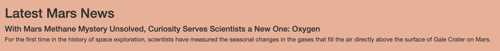
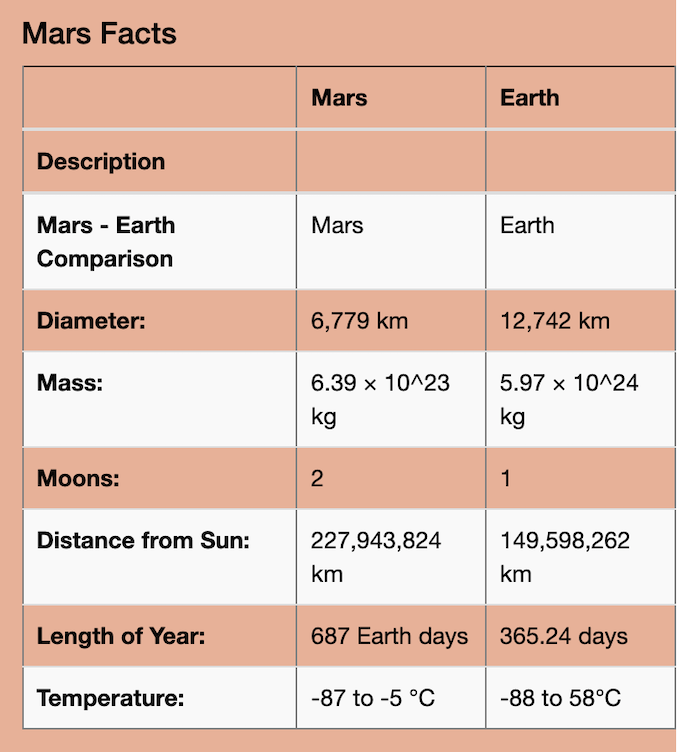
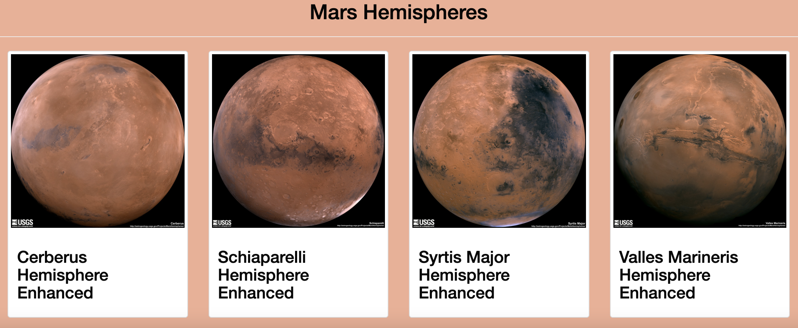

# Mission_to_Mars

Web scraping and MongoDb

## Overview of analysis:

The purpose of this project is to obtain data from various websites through a process called 'web scraping' using BeautifulSoup, splinter and Pandas.

Mars news was scraped from the url https://redplanetscience.com.  

Mars featured images were scrapped from the url 'https://spaceimages-mars.com.  

Mars facts were scrapped from the url 'https://galaxyfacts-mars.com'. 

Mars hemispheres .jpg images were scrapped from 'https://marshemispheres.com.

Once the data is scraped it is saved in an unstructured database called Mongodb. Flask is used to initiate scape and update the Mongodb database. Using index.html, a website is created called "Mission to Mars. The website has a button called "Scrape New Data", which when clicked updates the Mars News and Mars Featured images.

## Results:

The web scrapping went successfully and all the news, images ,table of Mars facts and mars hemispheres were scrapped and saved in Mongo database. Using Flask to create a connection to the database, a website was created.

